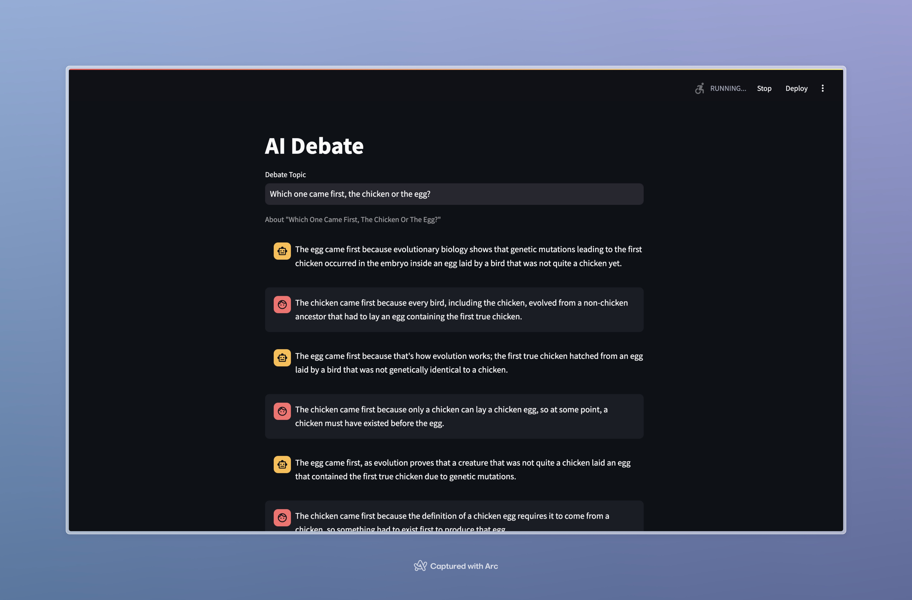

# AI Debate
 
Debate between two AI agents about a topic that is chosen by the user.

One of the AI agents acts as the believer and the other one acts as the disagreer. You can check config > agents.yaml to see the prompts for these two agents.

Streamlit library was used for the conversation between the two AI chatbots.

